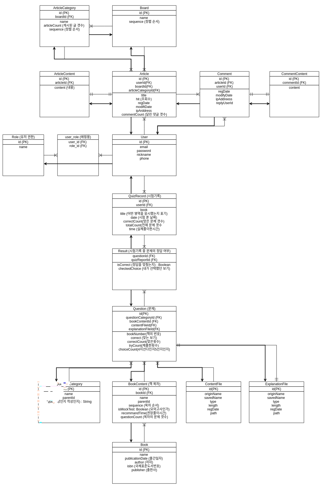

# PAT 
인적성검사 채점 결과와 백분위를 책 별로 관리해주는 오픈소스 플랫폼입니다. 
대입 혹은 편입학과 등급컷과 유사하게 내 점수를 관리하고, 타 경쟁자와의 백분위를 표시해 줍니다. 
PAT is a Open Source Project for Personality / Aptitude Tests in South Korea.
* What is Personality / Aptitude Tests in South Korea? [Click here](https://n.pr/2Twx43C) 

## 개발 개요(Development Overview)
* 1차 개발 기간(1st development period) : 2018/11/22 ~ 2019/2/27
* 개발자(Developer) : [윤지수](https://github.com/yjs2952), [장태희](https://github.com/janghe11), [정시윤](https://github.com/siyoon210)
* 핵심 기능(Core functions) : 문제 게재 기능, 문제 풀기 기능, 문제 채점 및 성적표 기능, 백분위 기능
* Docs : https://1drv.ms/f/s!AiWztNJa_dvMl0aqM2el7y-etQae
* Languages & Tools : Java Spring, MySQL
* 엔티티(Entities) : 
* Infrastructure Schema : 
* Demo Website : 
* Images
